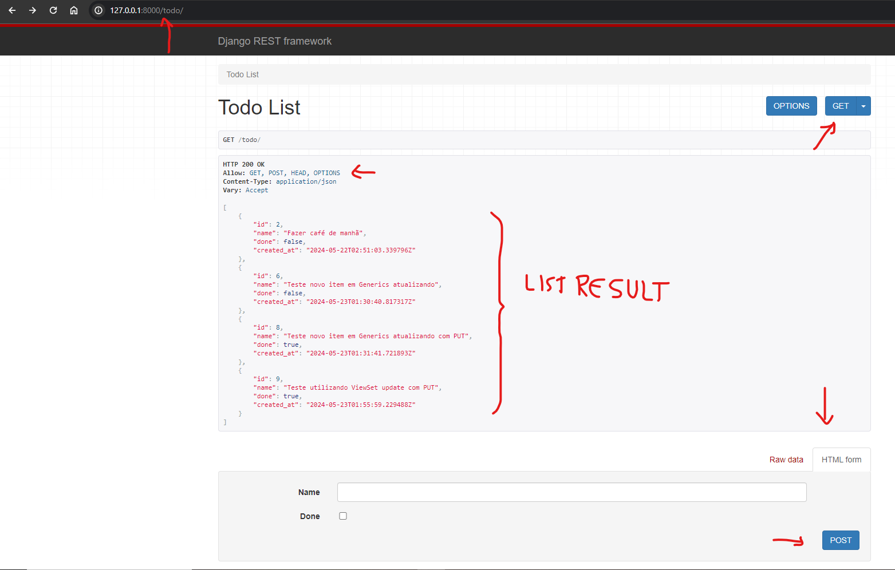
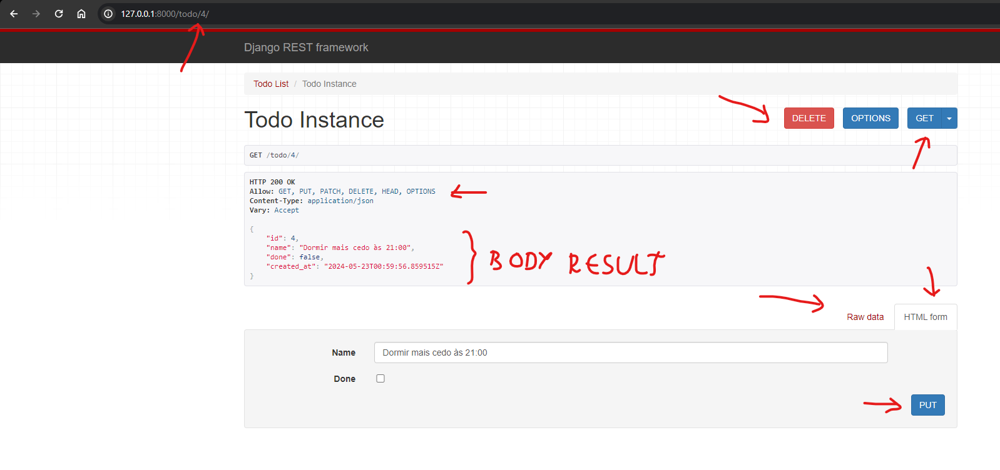

# Django REST Framework - [API-ToDo](https://api-todo-psi.vercel.app/todo/)

## Pequeno projeto didático para estudar Django REST Framework
Para ver esta API rodando acesse o link [API-ToDo](https://api-todo-psi.vercel.app/todo/).

## O que aprendi no curso "Criando APIs com Django REST Framework"

No curso "Criando APIs com Django REST Framework", disponível no YouTube na playlist "https://www.youtube.com/watch?v=c708Nf0cHrs", tive a oportunidade de me aprofundar no framework Django REST Framework e adquirir as habilidades necessárias para desenvolver APIs RESTful robustas e escaláveis em Python. Através de aulas teóricas e práticas, pude dominar os seguintes tópicos:

### 1. Fundamentos do Django REST Framework:

- Compreensão da arquitetura do Django REST Framework e seus principais componentes: serializers, views, viewsets, routers e URLs.
- Criação de serializers para serializar e desserializar dados entre formatos como JSON, XML e Python.
- Desenvolvimento de views genéricas e viewsets para gerenciar operações CRUD (Create, Read, Update, Delete) em recursos da API.
- Configuração de URLs com o Django REST Framework para mapear URLs para views e viewsets.
- Utilização de ferramentas de desenvolvimento como o Django REST Framework browsable API e o Postman para testar e interagir com a API.

### 2. Construindo APIs RESTful com o Django REST Framework:

- Desenvolvimento de views herdando de APIView, Class Base Views.
- Desenvolvimento de views herdando de generics, generics.ListCreateAPIView e generics.RetrieveUpdateDestroyAPIView.
- Desenvolvimento de views herdando de viewsets.
- Registrando rotas com DefaultRouter.
- Utilização de boas práticas de desenvolvimento de APIs RESTful para criar APIs robustas, escaláveis e fáceis de usar.
- Ganho de produtividade ao desenvolver CRUD para APIs RESTful.

### Interface de Lista e Inclusão:
Nesta imagem da interface de navegalçao web do Django REST Framework podemos ver o envelope de resultante das operações deste endpoint de Lista e Inclusão, também podemos ver o formulário de inclusão de um novo item na lista.

### Interface de Lista e Inclusão:
Nesta imagem da interface de navegalçao web do Django REST Framework podemos ver o envelope de resultante da operações deste endpoint de Detalhe, Alteração e Exclusão, também podemos ver o formulário de atualização de um item bem como o botão vermelho de exclusão.
